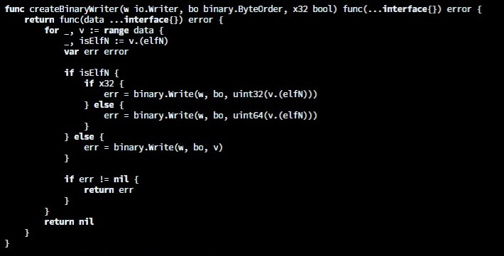

# bw.vim
A simple monochrome colorscheme for vim, compatible with light and dark themes. `bw.vim` only bolds control structures and italicizes strings and comments.

# Usage
1. Install with vim-plug or copy `bw.vim` into `~/.vim/colors/`
2. Add `colo bw` into your `.vimrc`
3. If you are using a light theme, add `set background=light` to your `.vimrc`

> NOTE: You may need to explicitly set background to dark
